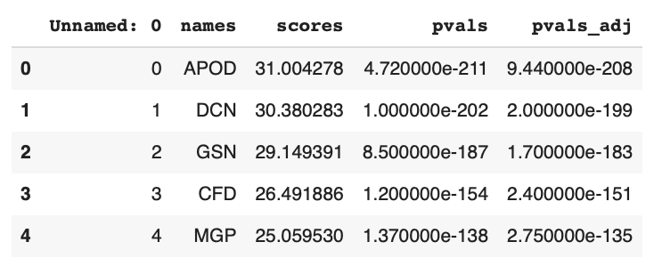
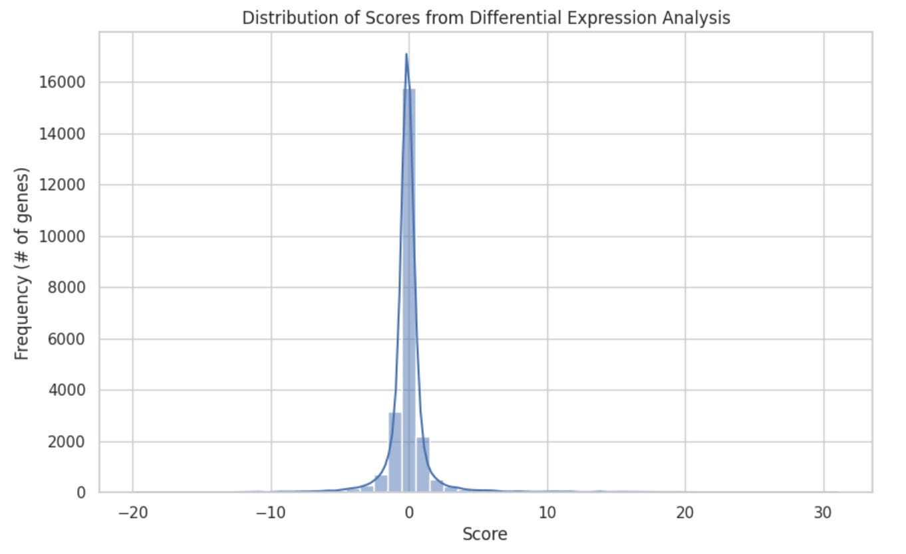
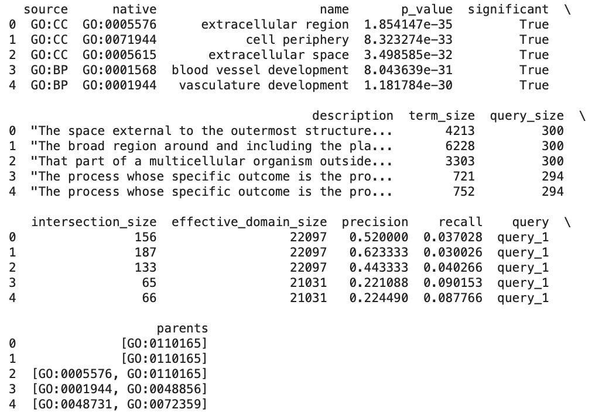
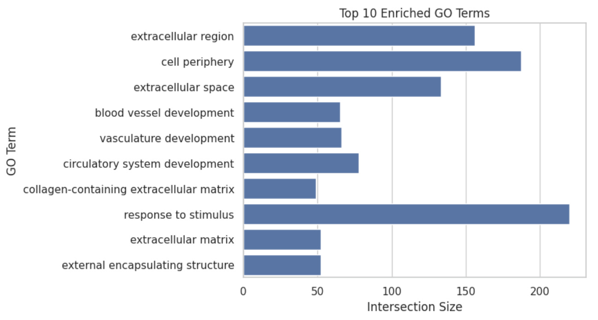
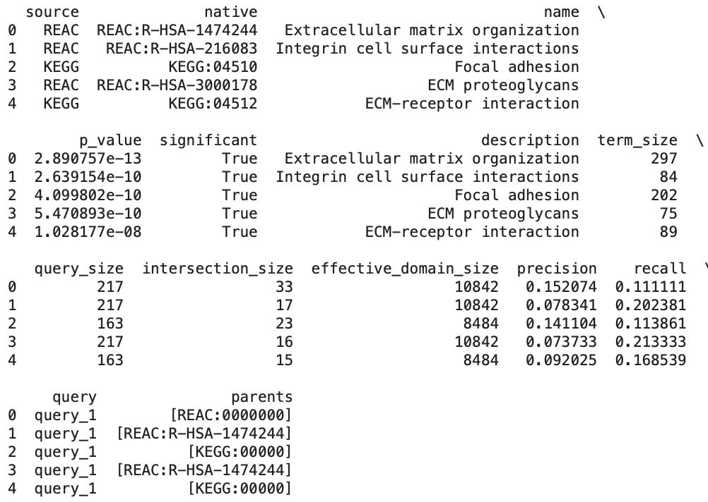
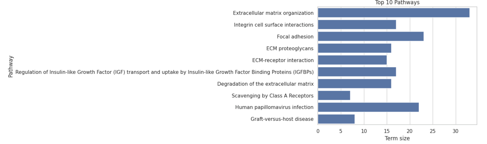
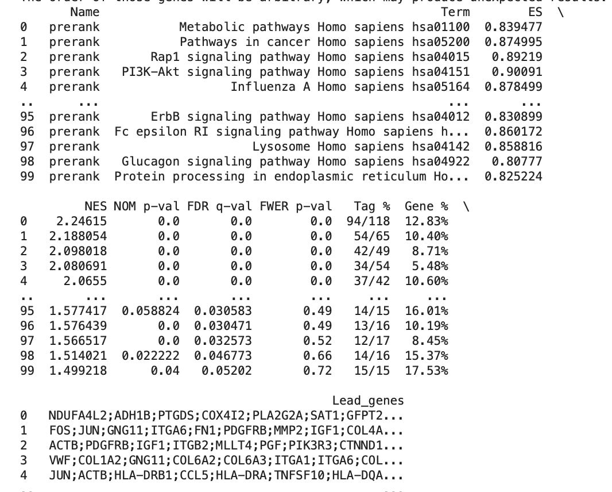

# 🧬 Introduction to Functional Enrichment Analysis  

Single-cell RNA sequencing (scRNA-seq) has transformed our understanding of cellular diversity, allowing researchers to explore cellular heterogeneity with unprecedented detail. To make sense of the vast amount of data generated by scRNA-seq, researchers often turn to three key analytical approaches: Gene Ontology (GO) analysis, pathway analysis, and Gene Set Enrichment Analysis (GSEA). Collectivley, these three methods fall under the broad category of analyses called functional enrichment analysis, which involves various computational techniques used to identify and interpret the biological functions, processes, and pathways that are overrepresented or significant in a given set of genes or proteins. 

In this article, we’ll explore the purpose, benefits, and applications of each approach, using skeletal muscle research as an example. However, it should be noted that all of the analyses discussed in this article have broader relevance in other fields, such as cancer research. Additionally, I’ll show you how to perform each analysis, using real-world scRNA-seq data. 

# 🧬 Gene Ontology (GO) Analysis 
### What Is Gene Ontology Analysis?

Gene Ontology (GO) analysis is a bioinformatics tool that categorizes differentially expressed genes according to their associated biological processes, cellular components, and molecular functions. This categorization is based on a structured, hierarchical vocabulary known as the Gene Ontology, which systematically describes gene functions. In the context of skeletal muscle research, GO analysis provides insights into the biological roles of differentially expressed genes, helping to elucidate the specific effects of exercise interventions.

While differential expression analysis identifies genes that are up- or down-regulated in response to an intervention, treatment, or drug regimen, GO analysis takes this a step further by linking these genes to broader biological contexts. By grouping genes into functional categories, GO analysis can reveal which biological processes, molecular functions, or cellular components are impacted, offering a more detailed understanding of the mechanisms through which an intervention, treatment, or drug exerts its effects.

### How Is GO Analysis Used In Skeletal Muscle  Research?

In skeletal muscle research, Gene Ontology (GO) analysis can be used to identify and categorize the biological processes affected by exercise or muscle injury. For example, after resistance training, GO analysis might show an enrichment of genes associated with muscle hypertrophy, such as those involved in "protein synthesis," "muscle fiber development," and "response to mechanical stimulus." This helps researchers understand which specific biological processes are driving muscle growth and adaptation, providing insights that can inform training protocols or therapeutic approaches to enhance muscle repair and regeneration.

### Performing GO Analysis

Before showing you how to perform GO analysis, I’ll import all of the libraries and data used in this tutorial. Notably, the dataset used in this tutorial contains a list of genes that are differential expressed following an exercise stimulus.

```python
# import libraries
import pandas as pd
from gprofiler import GProfiler
import matplotlib.pyplot as plt
import seaborn as sns
import gseapy as gp

# load data and view first few rows
filename = 'skeletal_muscle.csv'
data = pd.read_csv(filename)
skeletal_muscle = pd.DataFrame(data)
skeletal_muscle.head()
```


As you can see in the image above, our data frame contains a column named ```names```, containing the names of genes, a column named ```scores``` which represent a test statistic generated by a Wilcoxon rank-sum test for each gene (A gene with a positive score is up-regulated in the post exercise condition relative to baseline and negative score is down-regulated in the post exercise condition relative to baseline), and two columns named ```pvals``` and ```pvals_adj```, indicating the significance of each gene-associated score.

Now, before performing GO analysis we’l want to view the distribution of our scores, demonstrated in the code block below, to help us determine the optimal filtering criteria for selecting the most significant genes.

```python
# view distribution of scores
sns.set(style="whitegrid")
plt.figure(figsize=(10, 6))
sns.histplot(skeletal_muscle['scores'], bins=50, kde=True)
plt.title('Distribution of Scores from Differential Expression Analysis')
plt.xlabel('Score')
plt.ylabel('Frequency (# of genes)')
plt.show()
```



In the image above you can see that our Wilcoxon rank-sum test scores are normally distributed. We’ll now calacutle the mean and standard deviation of the scores, and then use our mean + 1.5 standard deviations as a threshold for identifying genes that are differentially expressed to a meaningful degree. Then, we’ll filter our genes with scores greater than this threshold and p-values below 0.05 and save these to a variable named ```significant_gene```s before extracting the list of gene names, which will be used in our GO analysis.

```python
# calculate mean and standard deviation of the scores
mean_score = skeletal_muscle['scores'].mean()
std_score = skeletal_muscle['scores'].std()

# set the threshold as mean + 1.5 standard deviations
threshold = mean_score + 1.5 * std_score

# filter for genes with scores greater than the threshold and p-value < 0.05
significant_genes = skeletal_muscle[(skeletal_muscle['scores'] > threshold) & (skeletal_muscle['pvals_adj'] < 0.05)]

# extract list of gene names for these significant genes
gene_list = significant_genes['names'].tolist()
```

Now, we’re ready to perform our GO analysis, as demonstrated in the code block below.

```python
# initialize GProfiler and return result in pandas DataFrame format
gp = GProfiler(return_dataframe=True)

# perform GO analysis using the significant gene list
go_results = gp.profile(organism='hsapiens', query=gene_list)

# display the first few results
print(go_results.head())
```



The output from our GO analysis includes various types of information, as shown in the image above. The ```source``` column indicates the origin of the GO term, where, for example, ```GO:CC``` refers to cellular component terms, and ```GO:BP``` refers to biological process terms. Each GO term has a unique identifier, which is listed in the ```native``` column.

The output also provides biological context for each GO term. The ```name``` column specifies what each GO term represents, and the ```description``` column offers additional details about its biological significance. The statistical significance of the GO terms is indicated by the ```p_value``` column, and the ```significant``` column contains a boolean value (True or False) that shows whether the enrichment is statistically significant.

To understand how certain GO terms are represented in the human genome and in our specific sample, we can look at the ```term_size```, ```query_size```, ```intersection_size```, and ```parents``` columns. ```Term_size``` indicates the total number of genes associated with a specific GO term in the reference human genome, while ```query_size``` shows the number of genes from our gene list that are potentially related to that GO term. ```Intersection_size``` refers to the number of genes from our list that are both associated with the GO term and identified as significant—this is a subset of ```query_size```. The ```parents``` column lists the parent GO terms of the current term, helping us understand the hierarchical relationships between terms.

Finally, the output includes evaluation metrics such as ```precision``` and ```recall```, which provide insight into the quality of the enrichment results. High precision indicates that most of the genes identified in the GO term are relevant, while high recall means that many of the relevant genes have been detected.

Now, to better understand these results I’ll use a bar graph to plot the top 10 enrichment terms against their respective intersection sizes, as demonstrated below.

```python
sns.barplot(x='intersection_size', y='name', data=go_results.head(10))
plt.title('Top 10 Enriched GO Terms')
plt.xlabel('Intersection Size')
plt.ylabel('GO Term')
plt.show()
```



As you can see, our top GO terms include cellular components, such as collagen-containing extracellular matrix, as well as biological processes including blood vessel, vascular, and circulation system development which make sense given that we’re our data contains genes that are differentially expressed following a robust exercise stimulus. In addition to the bar graph above, there are a number of other useful visualization for GO terms including enrichment maps, gene-concept network graphs, heat maps, GO term hierarchy trees, and CIRCOS plots.

# 🧬 Pathway Analysis
**What Is Pathway Analysis?**

Pathway analysis is a bioinformatics method used to identify signaling and metabolic pathways that are enriched in a list of differentially expressed genes, helping us understand how genes interact within specific pathways.

While similar to GO analysis, pathway analysis is more specific in that it maps differentially expressed genes to known biological pathways, such as those in KEGG or Reactome databases. This provides a detailed view of how genes function together in biological systems and can identify key pathways that are altered by treatment, which can help us understand complex biological mechanisms and identify potential therapeutic targets.

**How Is Pathway Analysis Used In Skeletal Muscle Research?**

In skeletal muscle research, pathway analysis can identify key pathways involved in muscle adaptation to exercise, such as the AMPK signaling pathway or the mTOR pathway. For example, after endurance training, pathway analysis might reveal the activation of oxidative phosphorylation and mitochondrial biogenesis pathways, indicating enhanced energy metabolism and mitochondrial function. This insight can help researchers understand the molecular mechanisms behind muscle endurance and guide the development of exercise regimens or nutritional strategies to optimize muscle performance.

**Performing Pathway Analysis**

Many of the steps involved in performing pathway analysis overlap with those from our GO analysis above. As a result, we can skip the initial steps and jump right to performing pathway analysis, using our list of significant genes (named gene_list), as demonstrated below.

```python
# perform pathway analysis
pathway_analysis_results = gp.profile( organism='hsapiens',  query=gene_list, sources=["KEGG", "REAC"])

# display the results
print(pathway_analysis_results.head())
```



As you can see in the image above, the results of our pathway analysis are similar to GO analysis, with a few subtle differences. For example, the ```native``` column refers to the database refers to the database from which a given pathway was identified, and instead of ```name``` referring to specific cellular components or biological processes it refers to pathways that are significantly associated with the genes in our list (i.e, the genes in our sample are likely to be involved in or affect these pathways more than would be expected by chance).

Now, we can visualize the top ten enriched pathways using the code below.

```python
sns.barplot(x='intersection_size', y='name', data=pathway_analysis_results.head(10))
plt.title('Top 10 Pathways')
plt.xlabel('Term size')
plt.ylabel('Pathway')
plt.show()
```



Notably, we’ve identified enrichment in a pathway associated with the regulation of IGF transport and uptake, which isn’t all that surprising given our data source. However, there are some unexpected results as well, such as the enrichment of a pathway associated with human papilloma virus infection. One potential reason for this may be that many cellular pathways are shared across different tissues. For instance, pathways involved in cell cycle regulation, stress responses, or apoptosis could be activated by HPV infection and might also be relevant in muscle cells. This cross-talk can lead to the identification of HPV-related pathways in seemingly unrelated tissues.

# 🧬 Gene Set Enrichment Analysis (GSEA)
**What Is Gene Set Enrichment Analysis?**

Gene Set Enrichment Analysis (GSEA) is a computational technique designed to determine whether predefined sets of genes show statistically significant differences in expression between two or more biological conditions. Unlike differential expression analysis, which identifies individual genes that change significantly between conditions, GSEA evaluates the entire ranked list of genes from before and after treatment. It does not require pre-selection of differentially expressed genes. Instead, GSEA assesses whether predefined gene sets—groups of genes associated by function, pathway, or other criteria—exhibit significant, coordinated changes in expression.

This method complements differential expression analysis by focusing on the enrichment of gene sets rather than changes in individual genes. It is particularly useful for detecting subtle, coordinated expression changes that might be missed when examining single genes in isolation.

**How Is GSEA Used In Skeletal Muscle Research?**

In the context of skeletal muscle research, GSEA can be applied to understand the broader effects of various exercise regimens or muscle-specific interventions on gene expression. For example, after a period of resistance training, GSEA might reveal significant enrichment of gene sets related to "muscle hypertrophy," "protein synthesis," or "muscle contraction." This indicates that the resistance training has led to coordinated changes in the expression of genes involved in these processes. By analyzing the entire ranked list of genes from pre- and post-training samples, GSEA can also identify whether specific biological pathways or functional gene sets are more prominently activated or repressed.

However, despite the utility of GSEA, there are scenarios where it may not be necessary. For example, if your research is narrowly focused on specific biological pathways or functions, other analytical methods like Gene Ontology (GO) analysis and pathway analysis might be sufficient. For example, if your study aims to understand the effects of a particular intervention on a known pathway, such as the mTOR pathway in muscle hypertrophy, pathway analysis could directly reveal how this specific pathway is impacted. In such cases, GSEA’s broader approach might provide redundant or less relevant information, making the more targeted analyses more appropriate.

**Performing GSEA**

In this last section, I’ll show you how to perform GSEA. To begin, we’ll need to prepare a rank file, which is a specific format used in GSEA to represent the ordering of genes based on a quantitative score, such as a Wilcoxon rank-sum test, log fold change, or p-value.

```python
# create rank file
rank_df = pd.DataFrame({'Gene': skeletal_muscle['names'], 'Score': skeletal_muscle['scores']})
rank_df.set_index('Gene', inplace=True)
```
Then, after creating our rank file we can perform GSEA using the code below.
```python
# perform GSEA and view results
gsea_results = gp.prerank(rnk=rank_df, gene_sets='KEGG_2016', permutation_num=100, seed=5)
print(gsea_results.res2d)
```


In the image above we can see specific terms that were tested for enrichment in our gene list and their associated enrichment scores, which measures the degree to which a gene set (pathway) is overrepresented. A positive enrichment scores indicates that the genes in the pathway are enriched at the top of the ranked list (i.e., more significant in your sample), and that there is a stronger association of the gene set with your sample data.

Additionally, pathways with high enrichment score values (close to 1) are those where the gene set is strongly enriched at the top of the ranked gene list. For example, in our results we see that the PI3K-Akt signaling pathway is highly enriched. This pathway regulated various cellular processes, including growth, proliferation, survival, and metabolism. It is activated by various growth factors and hormones, such as mTOR regulates cell growth and protein synthesis.

# 🧬 Integrating GO, Pathway Analysis, & GSEA

Using Gene Ontology (GO) analysis, pathway analysis, and Gene Set Enrichment Analysis (GSEA) together can provide a comprehensive understanding of single-cell RNA sequencing (scRNA-seq) data.

GO analysis offers detailed functional characterization by identifying specific biological processes and functions affected by treatments. It highlights how differentially expressed genes (DEGs) are related to various biological roles. Pathway analysis, on the other hand, provides systemic insights by examining how DEGs interact within biological pathways, pinpointing key signaling and metabolic pathways influenced by the treatment. GSEA takes a broader approach, assessing gene set enrichment across the entire dataset to capture coordinated, global changes and validate findings from the other analyses.

Employing all three methods can offer a more complete picture of the biological impact of treatments. While GO and pathway analyses provide specific insights into particular processes and pathways, GSEA reveals overarching trends and functional shifts. This combination of broad and specific analyses aids in generating and validating hypotheses about how treatments affect biological functions and pathways, strengthening the overall interpretation of the data.

In skeletal muscle research, applying all three analyses can enhance understanding of exercise or treatment impacts. For instance, after a period of resistance training, GO analysis might reveal that differentially expressed genes are primarily involved in "muscle hypertrophy" and "protein synthesis," providing detailed functional insights. Pathway analysis could then identify key pathways such as the "mTOR signaling pathway" that are significantly altered by the training. GSEA would complement these findings by highlighting global trends, such as overall enrichment in gene sets related to "muscle growth" and "cellular stress responses," across the entire dataset. This holistic approach helps confirm that the observed specific changes in pathways and functions are part of broader, coordinated biological responses to the resistance training.


